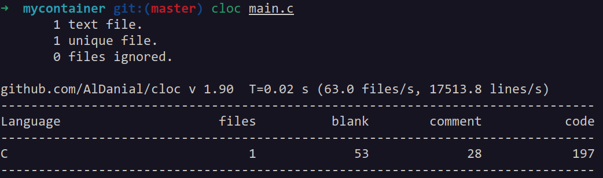
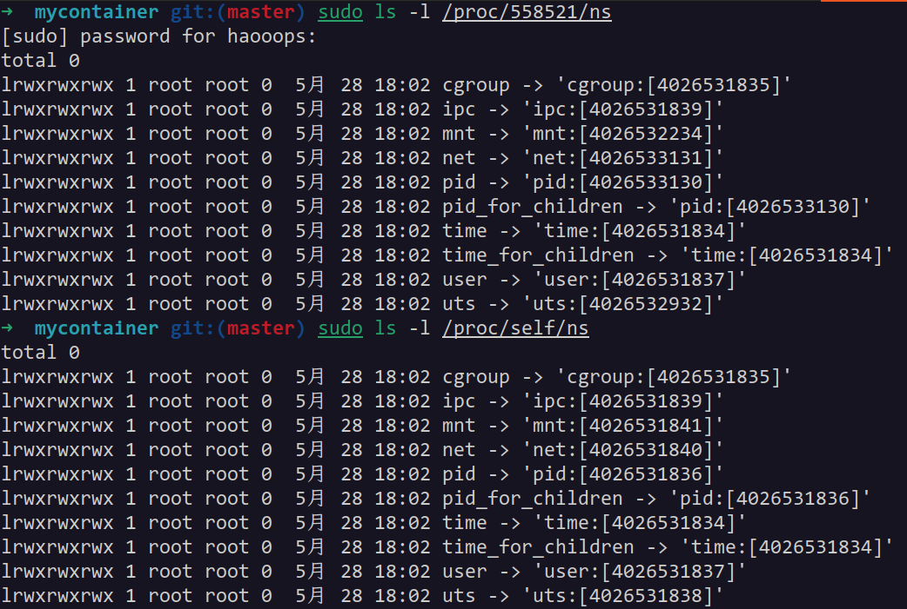
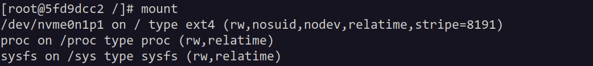
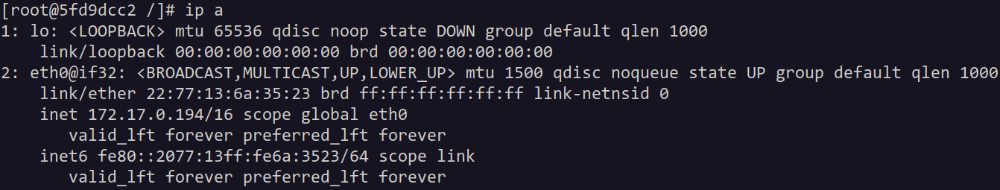
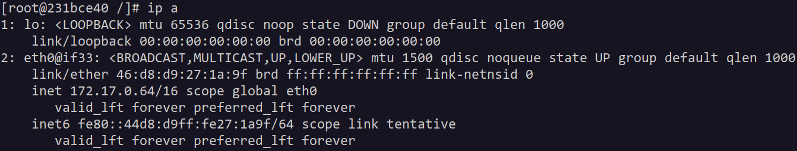
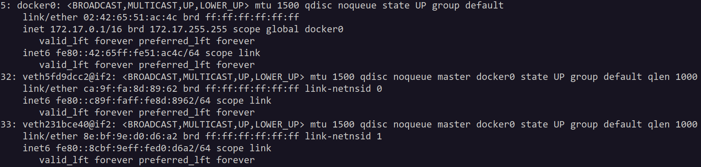
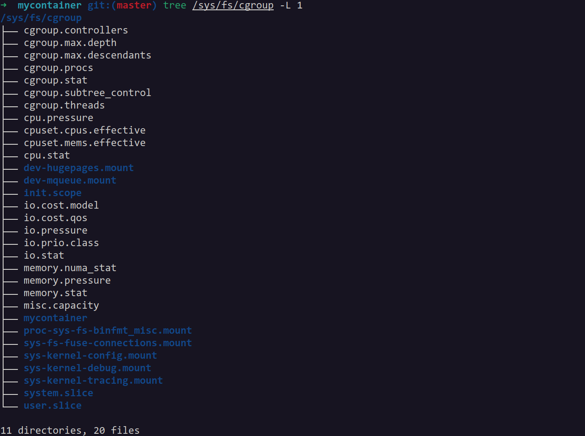
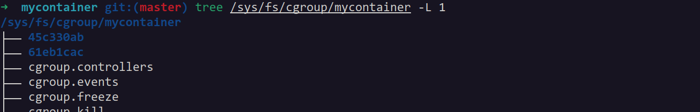
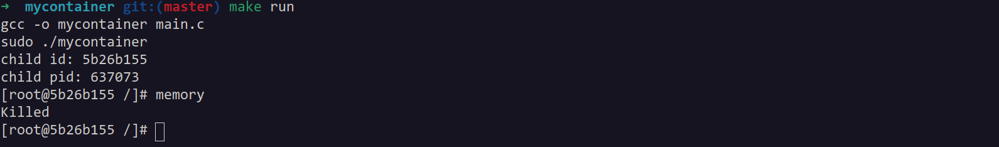

## 1 实验要求与完成情况

利用 Linux 操作系统的 Namespace 和 Cgroup 机制，实现一个简单的容器引擎，开发语言不限（shell脚本、C、Python等都可以）。

本文实现的容器引擎 mycontainer 具有下列功能，满足了所有实验要求：

- [x] 实现进程、用户、文件系统、网络等方面的隔离

- [x] 能够在 Ubuntu 系统上运行 CentOS 环境

- [x] 能够实现同一操作系统下两个容器之间的网络通信

- [x] 能够为容器分配定量的 CPU 和内存资源

容器引擎代码详见 github 仓库 [mycontainer](https://github.com/MiaoHao-oops/mycontainer)。

## 2 实验设计与运行效果

mycontainer 使用 C 语言实现，以短小精悍的代码量（197行，commit：[57aad60](https://github.com/MiaoHao-oops/mycontainer/commit/57aad60ca69fd713cb36277cdf24e72d01767355)）实现了所有实验要求。



### 2.1 资源隔离

mycontainer 利用了 Linux 的 namespace 机制，实现对进程、用户、文件系统、网络等方面的隔离。

#### 2.1.1 `clone()` 系统调用

`clone()` 系统调用是利用 Linux 内核 namespace 机制的关键，它的函数签名为（来源：`man 2 clone`）：

```c
int clone(int (*fn)(void *), void *stack, int flags, void *arg, ...
                 /* pid_t *parent_tid, void *tls, pid_t *child_tid */ )
```

它会创建一个新的子进程（这一点与 `fork()` 类似），根据参数为子进程创建新的 namespace，并将子进程放入这些新创建的 namespace 中。它的参数如下：

- `fn`：子进程的入口函数
- `stack`：子进程的栈
- `flags`：用于指定需要为子进程创建哪些 namespace
- `arg`：传给 `fn` 的参数

`flags` 可指定的 namespace 使用一系列宏进行定义，mycontainer 为容器子进程创建了下列独立的 namespace：

- `CLONE_NEWNS`：mnt namespace，用于隔离挂载点
- `CLONE_NEWUTS`：uts namespace，用于隔离 hostname
- `CLONE_NEWPID`：pid namespace，用于隔离进程 id
- `CLONE_NEWNET`：net namespace，用于隔离网络设备，网络栈等

`clone()` 系统调用仅仅是创建了新的 namespace，并将子进程放入这些 namespace，这一点对于容器资源隔离的要求还是不够的。在接下来的小节中，本文将具体说明如何进一步操作，以实现容器子进程资源的隔离。

通过 `/proc/[pid]/ns` 分别查看父子进程的 namespace 信息：



父子进程的 mnt、uts、pid 和 net namespace 是完全不同的，这正是 `clone()` 中 `flags` 参数起的作用。

#### 2.1.2 挂载点隔离

挂载点的隔离通俗来讲就是文件系统隔离，利用新创建的 mnt namespace，容器子进程将无法访问到父进程中的文件系统。为了达到这个目的，mycontainer 使用了 `pivot_root()` 系统调用，该系统调用可以交换跟目录 `/` 上的挂载点。

实现挂载点隔离的步骤为：

1. 在子进程中以 `bind` flag 重新挂载容器的 rootfs，使其成为一个挂载点
2. 在 rootfs 下创建一个目录 `old_root`，用于放置旧的根目录挂载点
3. 使用 `pivot_root()` 系统调用，将 rootfs 挂载到 `/`，旧的根目录挂载点挂载到 `old_root`
4. 解除 `old_root` 上的挂载，并删除 `old_root` 目录

通过以上步骤，容器子进程的挂载点就与父进程的完全隔离开了，在容器中挂载新的文件系统不会影响父进程的挂载点，同时，容器也无法访问父进程中的任何文件系统。

除了根目录需要挂载外，还有两个重要的文件系统需要容器子进程挂载，分别是 procfs 和 sysfs。它们分别用于展示进程信息和管理内核对象。

经过以上操作后，容器子进程的挂载点信息如下：



子进程中的挂载点包括了挂载在 `/` 上的 rootfs、`/proc` 上的 procfs 和 `/sys` 上的 sysfs。在父进程的 mnt namespace 中，则完全看不到这些挂载信息，说明 mnt namespace 起到了挂载点隔离的作用。

#### 2.1.3 hostname 隔离

uts namespace 起到了隔离 hostname 的作用，在容器的开发环境中，hostname 为：


在子进程中，mycontainer 使用了 `sethostname()` 系统调用为容器在新的 uts namespace 中重新设置了 hostname，具体而言，是一个随机产生的十六进制字符串：


#### 2.1.4 pid 隔离

pid 隔离的作用是使容器子进程中的进程 id 从 1 开始，并且与父进程中的进程 id 隔离。在使用 `clone()` 系统调用创建新的 pid namespace 后，无需进行额外的操作，容器子进程中的进程将从 1 开始顺序增加：


这里的 1 号进程是容器子进程通过 `execv()` 系统调用启动的 bash。

#### 2.1.5 网络隔离与网络通信

mycontainer 的网络使用了桥接模式，通过 veth 对将容器子进程的 net namespace 和父进程中的虚拟网桥相连，以实现容器之间的网络互通，连接示意图如下：

```
+---------------+           +---------------+
| mycontainer 0 |           | mycontainer 1 |
|   +-------+   |           |   +-------+   |
|   | veth1 |   |           |   | veth3 |   |
|   +-------+   |           |   +-------+   |
+-------|-------+           +-------|-------+
        |                           |
+-------|---------------------------|-------+
|   +-------+                   +-------+   |
|   | veth0 |                   | veth2 |   |
|   +-------+                   +-------+   |
|                    br0                    |
+-------------------------------------------+
```

其中的 veth1、br0 和 veth3 位于 3 个不同的 net namespace 中。在具体实现中，mycontainer 将每个容器子进程中的 veth 都命名为了 eth0，并且直接使用了父进程 net namespace 中 docker 的虚拟网桥 docker0。

为了实现简便，mycontainer 直接使用了系统中的 `ip` 工具，通过 `system()` 系统调用传递命令的方式，生成 veth 对、连接网络并配置 ip 地址。为了描述简便，本文将对应的 C 语言代码转化为了等价的 shell 命令以展示网络的配置过程：

- 父进程 net namespace 中的命令：
    ```sh
    # 1. 创建 veth 对，一个在父进程 net namespace 中，一个在子进程 net namespace
    $ ip link add name veth[id] type veth peer name eth0 netns [child_pid]
    # 2. 将父进程中的 veth 设备连接到网桥 docker0
    $ ip link set dev veth[id] master docker0
    # 3. 开启父进程中的 veth 设备
    $ ip link set dev veth[id] up
    ```

- 子进程 net namespace 中的命令：

    ```sh
    # 1. 配置子进程中 veth 设备的 ip 地址
    $ ip addr add 172.17.0.[id % 256]/16 dev eth0
    # 2. 开启子进程中的 veth 设备
    $ ip link set dev eth0 up
    ```

在上面的步骤中，父进程中的 veth 设备名称以及子进程的 ip 地址都是根据 `id` 设置的，这里的 `id` 指的就是 2.1.3 节中的 8 位十六进制 hostname。由于 hostname 采用随机数产生，因此一般情况下不会发生重名的问题。

使用 mycontainer 分别创建 2 个容器，分别查看它们的网络配置：





可以看到容器中的网络除了本地回环 lo 外，还有一个 eth0 设备，该设备就是连接父进程虚拟网桥 docker 0 的 veth 设备。查看父进程中的网络设备：



父进程中的两个 veth 设备均以容器的 id 命名，且它们已经连接到了虚拟网桥 docker0 上。尝试在一个容器中 ping 另一个容器：


可以正常地收发网络包，说明两个容器之间的网络是连通的。

### 2.2 在 Ubuntu 上运行 CentOS 环境

在使用 docker 时，容器的环境取决于启动容器时使用的镜像，这一点对于 mycontainer 也是类似的，只不过镜像变为了 rootfs。为了在 Ubuntu 上运行 CentOS 环境，只需要制作一个 CentOS 的 rootfs 即可。本文使用的方法是直接从 docker 的 CentOS 镜像中提取 rootfs，具体方法为：

1. 将 docker 的 CentOS 镜像导出为归档文件（压缩包）

    ```sh
    docker export $(docker create centos) --output="centos.tar"
    ```

2. 将归档文件解压

    ```sh
    mkdir rootfs
    tar -xf centos.tar -C rootfs
    ```

3. 查看 rootfs

    

当 mycontainer 将该文件夹作为 rootfs 启动时，运行的就是 CentOS 环境。

### 2.3 资源限制

mycontainer 利用了 Linux 内核中的 cgroup 机制进行了资源限制，具体而言是 CPU 使用率和内存使用量。mycontainer 的开发系统是 Ubuntu 22.04，该系统默认使用的是 cgroup v2，因此 mycontainer 的资源限制也是基于 cgroup v2 进行配置的。

与 cgroup v1 类似，cgroup v2 的所有配置文件位于 `/sys/fs/cgroup/` 下。cgroup v2 通过目录的父子关系表示控制组的父子关系，`/sys/fs/cgroup/` 表示根控制组，它下面的所有目录是根控制组的子控制组：



在上图中的系统中，根控制组中包含 11 个子控制组，它们除了 `mycontainer` 之外都是由 systemd 配置生成的。根控制组中的目录还可以进一步包含子目录，形成树状关系，比如在 `/sys/fs/cgroup/user.slice/` 中，包含 `/sys/fs/cgroup/user.slice/user-1000.slice`。

每个目录下的非目录文件是该目录所代表的控制组的配置文件，有两个文件决定了当前控制组和其子控制组中有哪些控制器：

- `cgroup.controllers`：决定当前控制组有哪些控制器生效
- `cgroup.subtree_control`：决定当前控制组的子控制组有哪些控制器生效

#### 2.3.1 mycontainer 的控制组结构

mycontainer 利用了 cgroup v2 的控制组树状结构，包含一个在根控制组下的名为 mycontainer 的控制组和若干位于 mycontainer 控制组下的容器控制组，这些容器控制组以容器 id 进行命名。例如，当使用 mycontainer 启动 2 个容器时，mycontainer 将创建对应的子控制组：



#### 2.3.2 利用 cgroup 对容器子进程进行资源限制

为了描述简便，本文将 C 语言代码对应的过程转化为了 shell 命令。

1. 创建容器子进程的子控制组

    ```sh
    mkdir /sys/fs/cgroup/mycontainer/[child_id]
    ```

2. 将容器子进程添加到子控制组中

    ```sh
    echo "[pid]" > /sys/fs/cgroup/mycontainer/[child_id]/cgroup.porcs
    ```

    控制组目录下的 `cgroup.procs` 用于配置哪些进程属于该控制组，在这里将容器子进程的 pid 写入该文件即可。

3. 对容器子进程的 CPU 使用率进行限制

    ```sh
    echo "200000 1000000" > /sys/fs/cgroup/mycontainer/[child_id]/cpu.max
    ```

    控制组目录下的 `cpu.max` 通过 2 个参数配置该控制组下进程的 CPU 使用率，第一个参数是代表了一个周期中进程可运行的时间，第二个参数是一个周期的长度，它们的单位均为 $\mu\text{s}$。这里相当于限制了容器子进程的 CPU 使用率为 20%。

4. 对容器子进程的内存使用量进行限制

    ```sh
    echo "1048576" >> /sys/fs/cgroup/mycontainer/[child_id]/memory.max
    echo "1048576" >> /sys/fs/cgroup/mycontainer/[child_id]/memory.high
    ```

    `memory.max` 和 `memory.high` 这两个文件控制的都是控制组下进程内存的最大使用量，单位为字节，它们的不同之处在于，`memory.max` 采用的是硬控制策略，如果内核发现控制组中进程的内存使用量超过了设置的数值，则会将进程 kill 掉；而 `memory.high` 使用的是软控制策略，它不会将进程 kill 掉，而是会尽可能地回收可用内存。这里限制了容器子进程的最大内存使用量为 1GB。

#### 2.3.3 资源限制效果

1. 使用负载 `yes > /dev/null` 对 CPU 使用率进行测试，使用 `htop` 工具查看该负载的 CPU 使用率：

    

    `yes` 负载的 CPU 使用率被限制在了 20% 左右，说明 mycontainer 通过 cgroup 对容器的 CPU 使用率进行限制起了效果。如果在代码中注释掉对 CPU 使用率的限制，再运行负载，则其 CPU 使用率将大幅上升，达到 60% 左右：

    

2. 使用一个 C 程序测试容器的内存使用量，C 程序为：

    ```c
    #include <stdlib.h>
    #include <unistd.h>

    #define ARRAY_SIZE (1024 * 1024 * 1024)
    int main()
    {
        char *a = malloc(ARRAY_SIZE * sizeof(char));

        for (int i = 0; i < ARRAY_SIZE; i++) {
            a[i] = i % 8;
        }

        free(a);
        return 0;
    }
    ```

    上面的 C 程序通过 `malloc()` 申请了一个大小为 1GB 的数组，尝试在容器中运行它：

    

    由于 1GB 正好超过了在 `memory.max` 中的限制，因此 memory 进程被 kill 掉了，说明 mycontainer 成功地通过 cgroup 对容器的内存使用量进行了限制。

## 3 总结

通过本实验，我实现了一个精简的容器引擎 mycontainer，它具有资源隔离、可运行 CentOS 环境、容器间可进行网络通信、定量的资源使用限制这些特点。在实现 mycontainer 的过程中，我对于 Linux 内核中的 namespace 和 cgroup 机制有了更加深入的了解。
